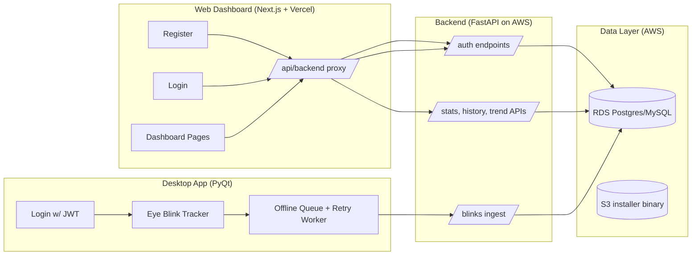

# 👁️ Wellness at Work – Cloud-Synced Eye-Blink Tracker  

A production-ready, privacy-aware full-stack system that tracks blink health in real time, syncs anonymized blink-metrics to the cloud, and visualizes eye-health analytics from a web dashboard.

---

## 💡 Why This Exists

Laptop users blink less during screen time — leading to eye strain, fatigue, headaches, and dry eye symptoms.  
Wellness-at-Work (WaW) provides continuous eye-health monitoring without capturing video, ensuring privacy while helping users build healthier visual habits.

---

# 🧩 System Overview

**Core Features**

- 🖥️ Desktop eye-blink tracking (PyQt)
- 🌐 Web analytics dashboard (Next.js + Vercel)
- ☁️ Secure backend + DB (FastAPI + AWS RDS)
- 🔗 Click-to-install desktop client served from S3
- 🔐 GDPR-aware security + consent model
- 📡 Offline-first batching + retry queue
- 📊 Read-only dashboards w/ stats + trends
- 📦 Installer packaging (.exe)

---

# 🏗️ High-Level Architecture



---

# 🔁 End-to-End Workflow

1. User registers on the web and consents  
2. Backend creates user + consent record in DB  
3. User downloads installer from S3  
4. Desktop login retrieves JWT  
5. Blink tracker counts blinks locally  
6. Blink batches sent to backend over HTTPS  
7. Backend writes blink events into RDS  
8. Dashboard fetches read-only analytics via secure API  

Offline?  
→ desktop queues data locally until network restores.

Idempotent batching prevents double-insertion on retries.

---

# 🖥️ Desktop App – PyQt (Python)

### Responsibilities

- Perform local blink detection
- Provide real-time health indicators
- Track resource impact (CPU/RAM/power)
- Sync anonymized blink deltas to backend
- Maintain offline queue + retry worker

### Local JSON batch example:

```json
{
  "events": [
    {
      "timestamp": "2025-12-20T04:15:30Z",
      "blink_delta": 3,
      "session_id": "uuid",
      "session_duration_sec": 600,
      "session_rate_bpm": 14.2
    }
  ]
}
```

### Planned Enhancements

- tray menu + background-mode  
- blink logic migrated C++ for high FPS processing  
- notifications for low blink rate  

---

# ☁️ Backend – FastAPI + AWS

### Stack

- FastAPI running on EC2 inside VPC
- HTTPS termination via load balancer
- RDS (PostgreSQL / MySQL)
- S3 for installer hosting

### Core API Surface

Auth  
```
POST /auth/register  
POST /auth/login
```

Blink ingest  
```
POST /api/user/me/blinks
```

Dashboard  
```
GET /api/user/me/stats
GET /api/user/me/blinks?range_period=week
GET /api/user/me/trends?period=week
GET /api/user/me/blinks/export?format_type=csv&days=30
```

---

# 🗄️ Schema (Conceptual)

### users
- id UUID
- email (unique)
- name
- password_hash
- timezone
- consent_given (bool)
- consent_at timestamp
- created_at timestamp

### blink_events
- id UUID
- user_id FK
- timestamp UTC
- blink_delta int
- session_id UUID
- session_duration_sec
- session_rate_bpm
- created_at timestamp

### (Optional) Aggregations
- user_blink_daily_aggregates  

---

# 🌐 Web App (Next.js + Vercel)

### Pages  

/register  
collects name, email, password, timezone + consent  

/login  
fetches JWT and stores under `waw_token`  

/dashboard  
fetches:
- stats
- blink history
- trend summaries
- csv export  

### UI Elements  

- risk labels based on range thresholds  
- table w/ scroll for large blink history
- consistency + peak hour indicators  
- export CSV button  

---

# 🔒 GDPR + Security

### Already implemented  

✔ explicit consent + timestamp  
✔ per-user JWT auth  
✔ password hashing (bcrypt/pbkdf2)  
✔ HTTPS for all transport  
✔ private VPC for backend + DB  
✔ S3 public-read only for installer binary  

### With more time  

- automated retention  
- full right-to-erasure endpoint  
- audit trails  
- key rotation + secrets manager  
- rate limiting + WAF  
- pip/npm dependency audits  

---

# ⚙️ CI/CD + Testing

### CI triggers per push commit

Frontend  
- install deps  
- lint + build  
- block failed builds  

Backend  
- pip install  
- import-based smoke test  

### Designed Test Cases

Auth  
- success + failure cases  
- duplicate email  
- invalid jwt  

Ingest  
- idempotent resend  
- large offline queue flush  

Dashboard  
- correct aggregates  
- trend direction logic  
- no-data state handling  

---

# 🚀 Running Locally

## Backend (FastAPI)
```bash
cd backend
python -m venv .venv
source .venv/bin/activate
pip install -r requirements.txt

export DB_URL=""
export JWT_SECRET=""

uvicorn app.main:app --reload
```

## Web App (Next.js)
```bash
cd web
npm install
cp .env.example .env.local
# configure BACKEND_BASE + NEXT_PUBLIC_EYETRACKER_URL
npm run dev
```

## Desktop (PyQt)
```bash
cd desktop
python -m venv .venv
source .venv/bin/activate
pip install -r requirements.txt
python main.py
```

---

# 📦 Distribution

### Windows
- packaged with pyinstaller  
- uploaded to S3  
- link exposed via environment variable `NEXT_PUBLIC_EYETRACKER_URL`  

### macOS planned options  
- signed .dmg  
- TestFlight  
- App Sandbox  

---

  

---

# 📍 Status Summary

This repo demonstrates a production-style implementation with attention to:
- privacy first design
- cloud principles
- event ingestion reliability
- minimal personally identifiable processing
- user-centric transparency of their blink health  
